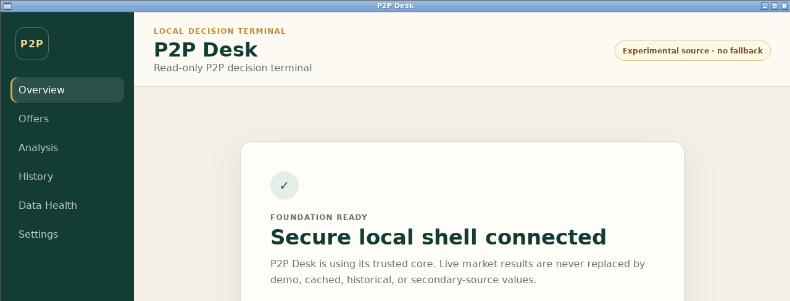

# P2P Desk

**A local read-only terminal for comparing public P2P offers with exact calculations and explicit data-quality states.**

## Why

P2P offer lists are easy to misread when request sides, transaction limits, payment routes, or numeric precision are handled loosely. P2P Desk is being built to validate those details before presenting a result. It does not connect to an account or prepare or execute trades.

The live source is an unsupported website contract and is always labeled **Experimental Binance P2P Web**. Source failures fail closed; cached, historical, secondary, or fabricated values never appear as live data.

## What it is

- A Tauri 2 desktop application with a React/TypeScript interface and trusted Rust core.
- A symmetric Buy asset / Sell asset analysis from one shared amount, payment, and filter context.
- A local application with no account credentials, telemetry, hosted backend, or trading actions.

## Preview

<p align="center">
  
</p>

The screenshot shows the current foundation shell. Complete production pages, reports, and release packages are still in development; it is not the finished application.

The user-approved production visual baseline is the self-contained [compact production UI](design/p2p-desk-production-ui-approval-v2.html). Its displayed values and merchant labels are illustrative interface content only—not live, cached, historical, or captured provider data.

## Current capabilities

| Capability                                   | Current behavior                                                                                                                                                                 |
| -------------------------------------------- | -------------------------------------------------------------------------------------------------------------------------------------------------------------------------------- |
| Desktop foundation                           | Restrictive CSP, narrow typed IPC, local assets, least-privilege Tauri capability, and safe window-state handling                                                                |
| Exact domain core                            | String-only exact decimal boundary, side and eligibility validation, deterministic ranking, quotes, costs, robust statistics, sensitivity, and constrained multi-ad calculations |
| Verification                                 | Locked formatting, linting, type checks, frontend/Rust tests, security invariants, and production web build                                                                      |
| Experimental live provider                   | Validated fail-closed Rust adapter, eligible-target scheduling, circuits, pair checks, and isolated Agent metadata                                                               |
| SQLite persistence and recovery              | Strict exact-text schema, atomic two-side publication, pseudonymous/content-addressed history, tiered retention, cost versions, migration backup, validated restore, and clears  |
| Lifecycle and refresh orchestration          | Typed startup, restored draft/applied context, Rust-owned auto scheduling, cancellation, freshness, atomic publication, and post-commit pruning                                  |
| Complete production UI, reports, and release | Not implemented yet                                                                                                                                                              |

## Requirements

- Node.js 24.18.1
- npm 11.16.0
- Rust 1.97.1 with `rustfmt` and `clippy`
- Tauri system dependencies for the development platform

Platform prerequisites and locked commands are in [docs/build.md](docs/build.md).

## Quick start

```bash
git clone https://github.com/Ahmed-Sleem/p2p-desk.git
cd p2p-desk
npm ci --ignore-scripts
npm run verify
npm run tauri:dev
```

No provider credentials or environment variables are required.

## Repository layout

```text
app/                 React and TypeScript frontend
crates/p2p-domain/       exact validated calculation core
crates/p2p-provider/     fail-closed experimental provider adapter
crates/p2p-persistence/  SQLite, retention, migration, backup and restore core
crates/p2p-lifecycle/    typed startup, refresh, settings and publication state
src-tauri/               trusted desktop shell and Rust integration
docs/                public architecture, security, and build notes
scripts/             verification and dependency tools
```

## Further documentation

| Document                                       | Purpose                                               |
| ---------------------------------------------- | ----------------------------------------------------- |
| [Architecture](docs/architecture.md)           | Trust boundary and module ownership                   |
| [Build](docs/build.md)                         | Toolchains, prerequisites, and verification commands  |
| [Security](docs/security.md)                   | Local-only frontend and capability policy             |
| [Provider contract](docs/provider.md)          | Experimental source controls and failure policy       |
| [Lifecycle](docs/lifecycle.md)                 | Startup, settings, scheduling, and publication graph  |
| [Persistence](docs/persistence.md)             | SQLite, privacy, retention, backup, and restore       |
| [Schema catalog](docs/persistence-schema.md)   | Migration checksum, relations, and storage invariants |
| [Dependency review](docs/dependency-review.md) | Dependency and advisory handling                      |

## Planned release targets

- Windows 10/11 x64 portable `P2PDesk.exe` using system WebView2
- Intel macOS (`x86_64-apple-darwin`) `.app` archive for macOS 12 or later

Release artifacts will be unsigned unless legitimate platform signing credentials are supplied. No release-ready claim is made until the complete test, platform, and live-source gates pass.

## License

MIT — see [LICENSE](LICENSE).
