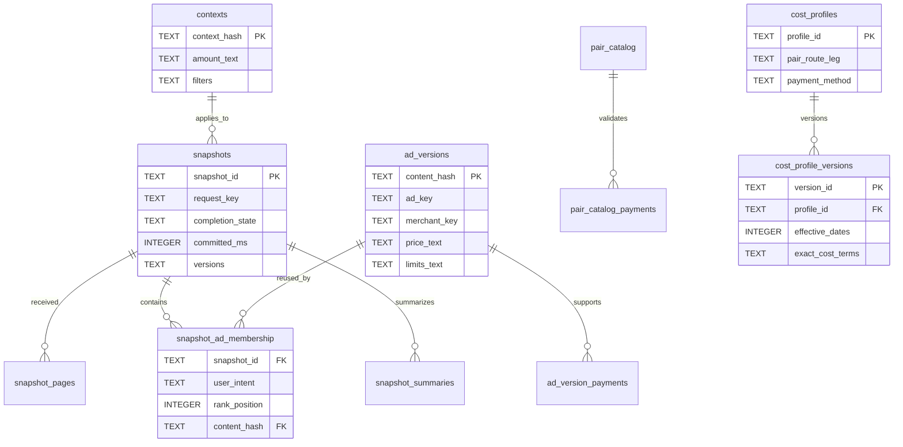

# Persistence schema and migration catalog

## Migration catalog

| Version | Name                         | SHA-256 of embedded SQL                                            | Purpose                                                                          |
| ------: | ---------------------------- | ------------------------------------------------------------------ | -------------------------------------------------------------------------------- |
|       1 | `initial_atomic_persistence` | `ba10e8506970a9eb34ca322096a7dd42713f159518bfe007598b5b1482c82986` | Initial strict atomic-history, local-state, retention, cost, and recovery schema |

The runtime stores this checksum in `schema_migrations`, sets `PRAGMA user_version`, and refuses to continue if a recorded migration differs from the compiled catalog. An existing database is backed up immediately before each pending migration. Migration SQL, migration record, and `user_version` change commit in one exclusive transaction.

## Logical diagram

## Table inventory

### Atomic history

- `contexts` — content-addressed applied pair/amount/payment/filter context.
- `snapshots` — complete two-side header, source/version provenance, timestamps, and both-side quality.
- `snapshot_pages` — contiguous per-side page receipt times.
- `ad_versions` — content-addressed normalized exact ad/merchant facts using only pseudonymous identifiers.
- `ad_version_payments` — normalized payment membership.
- `snapshot_ad_membership` — complete snapshot/intent/rank membership and observation time.
- `snapshot_summaries` — raw-cadence derived side metrics with exact text values.
- `history_rollups` — hourly/daily pair-side metrics and calculation version.
- `retention_events` — dated expired-tier and early-cap maintenance facts.

### Durable local state

- `pair_catalog` and `pair_catalog_payments` — locally validated pair/payment metadata and explicit disabled state.
- `cost_profiles` and `cost_profile_versions` — pair/route/leg identity and immutable effective versions.
- `settings` — sectioned bounded JSON settings.
- `chart_annotations` and `named_views` — versioned bounded local chart documents.
- `report_audit` — report ID, source snapshot key, package hash, and non-sensitive destination hint.
- `diagnostic_index` — redacted diagnostic category/index metadata only.

### Control

- `schema_migrations` — compiled migration identity and checksum.
- `metadata` — current app, provider, domain, and calculation versions.

## Storage invariants

- Every table is SQLite `STRICT`; relation tables use `WITHOUT ROWID` where appropriate.
- No column is declared `REAL`.
- Exact values use canonical decimal `TEXT`; counts/times/flags use checked `INTEGER`.
- No table or column stores a merchant nickname, provider response body, or raw provider payload.
- Snapshot membership cannot exist without a complete header or normalized ad version.
- Cascades remove complete dependent sets; ad versions are deleted only after no membership references them.
- Runtime checks compare the complete SQLite object catalog with the compiled migration schema and reject extra or altered objects; semantic audits also validate stored JSON and canonical decimals at open and after restore.
